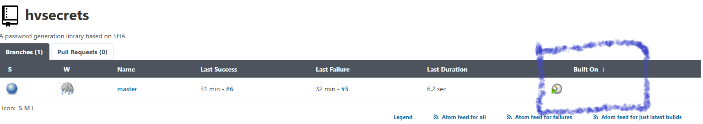

[[built-on-column-plugin]]
= Built On Column Plugin

link:https://ci.jenkins.io/job/Plugins/job/built-on-column-plugin/job/master/[image:https://ci.jenkins.io/job/Plugins/job/built-on-column-plugin/job/master/badge/icon[Build]]
link:https://github.com/jenkinsci/built-on-column-plugin/graphs/contributors[image:https://img.shields.io/github/contributors/jenkinsci/built-on-column-plugin.svg?color=blue[Contributors]]
link:https://plugins.jenkins.io/built-on-column/[image:https://img.shields.io/jenkins/plugin/i/built-on-column.svg?color=blue&label=installations[Jenkins Plugin Installs]]
link:https://plugins.jenkins.io/built-on-column/[image:https://img.shields.io/jenkins/plugin/v/built-on-column.svg[Plugin]]

Adds a column that shows the actual node the last build was run on.

== Screenshots

