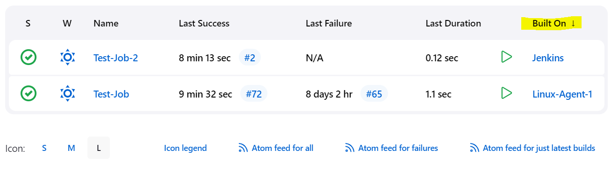

# Built On Column Plugin

This plugin Adds a column on the jenkins dashboard that shows the actual node the last build was run on.

# Why should you contribute

You can contribute in many ways, and whatever you choose we're grateful! Source code contribution is the obvious one but we also need your feedback and if you don't really want to participate in the implementation directly you may still have great ideas about features we need (or should get rid of).

We have our vision for the plugin and we have an experience with maintaining Jenkins instances, but the plugin is not supposed to solve only our problems. Surely we haven't experienced all of them... That's why we want to hear from you.

Please use GitHub issues if you need to report a bug or request changes/improvements. Whenever you report a problem please provide information about:

* Plugin version (Configuration as Code plugin as well any other plugin you suspect your problem to be related to)
* Jenkins version
* Operating system
* Description!

## Run Locally

Prerequisites: Java, Maven 

 * Ensure Java 8 or 11 is available.

```bash
  $ java -version	
```

- Ensure Maven is included in the PATH environment variable.

```bash
  export PATH=$PATH:/path/to/apache-maven-3.8.6/bin
```
* To run a plugin locally, the command is:

```bash
  mvn hpi:run
```

* That starts a Jenkins controller with the minimum Jenkins version supported by the plugin and loads the plugin and its dependencies into that controller. Jenkins will be running on port 8080 and can be reached with the URL http://localhost:8080/jenkins/

  If a plugin maintainer wants to use a different Jenkins version, they run the command:


```bash
  mvn -Djenkins.version=2.375.1 hpi:run
```

* If a plugin maintainer wants to use a different HTTP port, (as in http://localhost:9090/jenkins) they run the command:

```bash
  mvn -Dport=9090 hpi:run
```

* If a plugin maintainer wants to allow other computers to access that Jenkins controller while it is running, they run the command:

```bash
  mvn -Dhost=0.0.0.0 hpi:run
```




## Version history

See [GitHub Releases](https://github.com/jenkinsci/built-on-column-plugin/releases)
